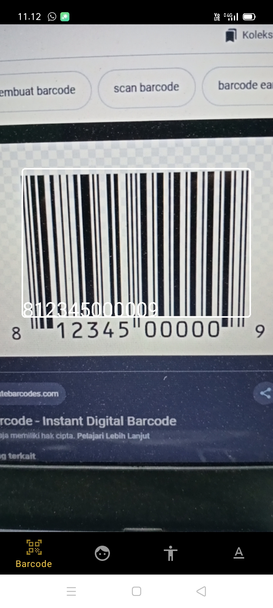
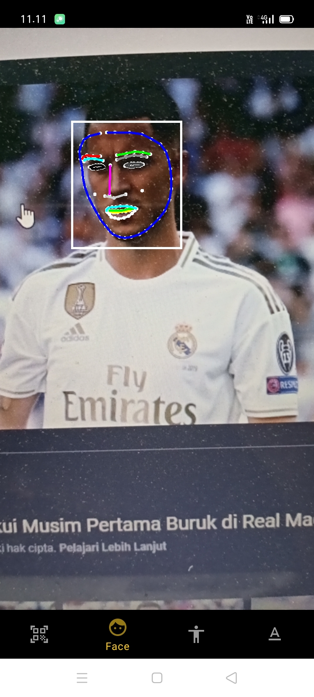
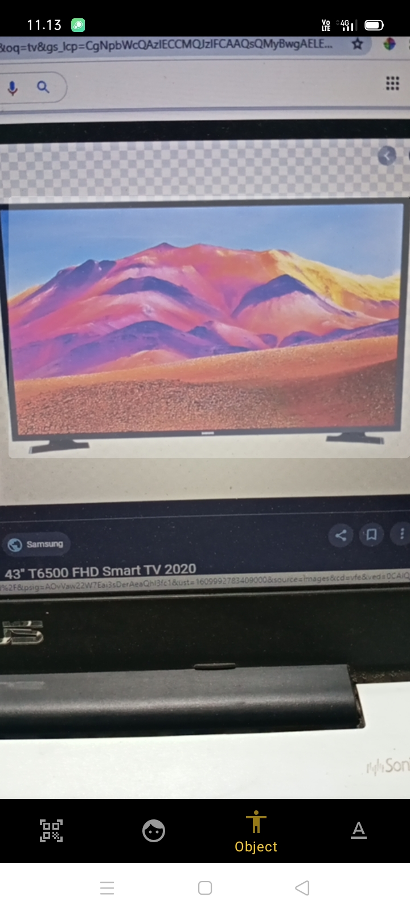

## MLKit with CameraX

Aplikasi machine lerning yang menggunakan library MLkit dari firebase dan CameraX sebagai library kamera yang ter-include dalam jetpack component. Aplikasi ini dibuat sebagai hasil research saya belajar tentang machine learning di android dan penggunaan kamera menggunakan library ``CameraX``.

link download ======> https://dply.me/toowxj

## Fitur
- Barcode Scanner
- Face Detection
- Object Detection
- OCR (Text Classifier)


## ☝🏼 how to use this project ?

Clone repo ini, kemudian project ada di file mlkit
```bash
git clone https://github.com/farhanroy/android-research/
```
## 📱 Screenshots

<table>
      <tr>
        <td>
           
        </td>
        <td>
           
        </td>
        <td>
            
        </td>
        <td>
            
        </td>
      </tr>
    </table>


## Author

👤 **Farhan Roy**

- Facebook: [Broding Camel](https://web.facebook.com/farhansekargadung)
- Github: [Farhan Roy](https://github.com/farhanroy)

